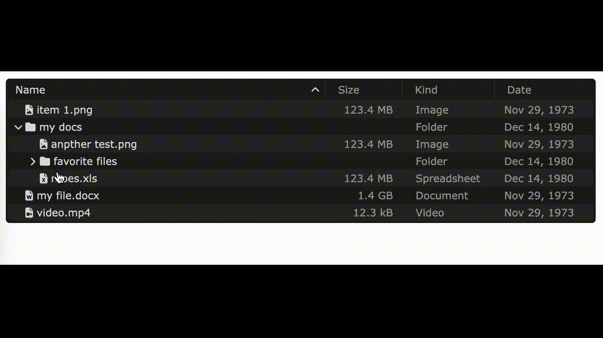

# FSTable

A responsive, animated filesystem table based loosely on Mac's Finder.

Demo: https://pamblam.github.io/finder-clone/



# Usage

Grab a copy of the JS and CSS from the `/dist` folder and add them to your page (Need Fontawesome 6, too):

```html
<link rel="stylesheet" href="https://cdnjs.cloudflare.com/ajax/libs/font-awesome/6.5.1/css/all.min.css" />
<link rel="stylesheet" href="./FSTable.min.css" />
<script src="FSTable.min.js" type="module"></script>
```

Add a div to your HTML that will serve as the file system table:
```html
<div id='fstable'></div>
```

Import the library in your javascript and initialize the object:
```js
// Remeber, you script tag must have type='module' to import and export
import { FSEntry, FSTable } from "./FSTable.js";
let ele = document.querySelector('#fstable');
let fsTable = new FSTable(ele);
```

Add the root files and folders to your instance:
```js
// get the files from the server, however you want.
let files = await getFiles("/"); 

// `addEntries` takes an array of FSEntry instances
fsTable.addEntries(files.map(file=>{
    // FSEntry types supported out of the box are:
    // 'Spreadsheet', 'Document', 'PDF', 'Archive', 'Video', 'Powerpoint', 'Image', 'Code', 'Audio', and 'Folder':
    return new FSEntry(file.basename, file.bytes, file.type, file.unix_timestamp);
}));
```

Load some more files when a folder is expanded:
```js
fsTable.on('folder.expand', function(entry){
    // FSEntry.getPath() takes a filesystem separator ('/' by default) and returns the path to the current entry
    let path = entry.getPath('/');
    let files = await getFiles(path); 

    // The second parameter to FSable.addEntries() is the parent entry to add the files to
    fsTable.addEntries(files.map(file=>{
        return new FSEntry(file.basename, file.bytes, file.type, file.unix_timestamp);
    }), entry);
});
```